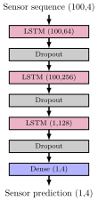
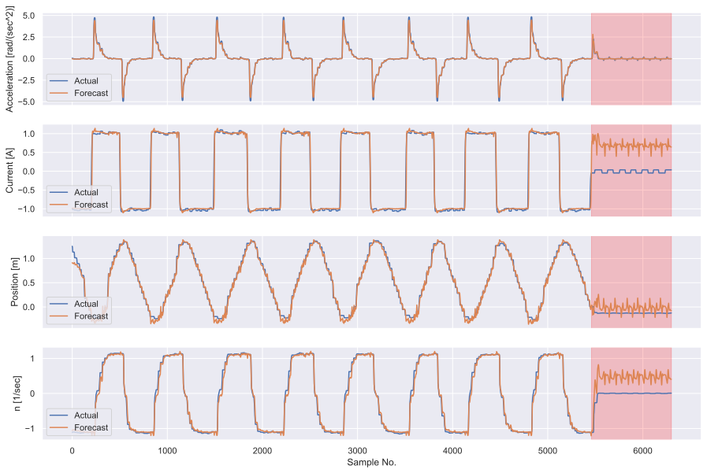
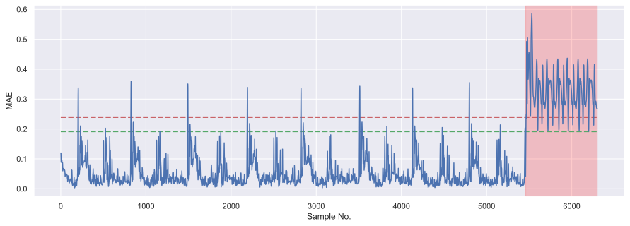

# Log/Sensor Anomaly Detector

With regard to the latest developments in the ISO/IEEE 11073 service-oriented device connectivity (SDC) its important to not leave possible security and safety risks of this new communication protocol out of consideration. Therefore the basic idea of this project (carried out during the author's bachelor thesis) was to improve the security as well as the safety of sdc connected medical devices with ML based anomaly detection. 
The concept is illustrated in the following chart: 

So the safety and security system is itemized in two anomaly detectors: one network intrusion detection system and one log/sensor anomaly detector (content of this repository). 
While the nids runs directly on the switch that interconnects different medical devices, the log anomaly detector runs in the backend. 
## Dependencies
The necessary dependencies are listed in `requirements.txt`: use `pip install -r requirements.txt` to install all suitable versions. Additionally, for the synthetical data generation Matlab has to be installed with the Simscape Multibody Library. Further the Nvidia cuDNN library is needed to train and execute the LSTM model on your supported Nvidia GPU. 
## Underlying papers and informations

+ code is based on [paper](https://arxiv.org/abs/1612.06676)
+ [A Survey of Predictive Maintenance: Systems, Purposes and Approaches](https://arxiv.org/abs/1912.07383)
+ [A One-Class Support Vector Machine Calibration Method for Time Series Change Point Detection](https://arxiv.org/abs/1902.06361)
    + heuristic optimization of OCSVM model
    + model used to predict transition region in engine degradation states to prevent further failures
+ [Real-Time Context-aware Detection of Unsafe Events in Robot-Assisted Surgery](https://arxiv.org/abs/2005.03611)
    + supervised training of two DNN models
    + one to classify the context and one to look out for anomalies 
    + Gazebo to generate data with injected faults, like fast speed jumps 
+ [Real-Time Predictive Maintenance using Autoencoder Reconstruction and Anomaly Detection](https://arxiv.org/abs/2110.01447)
    + realtime anomaly detection to predict future failures of an electrical motor
    + stacked autoencoder
+ [Graph Neural Network-Based Anomaly Detection in Multivariate Time Series](https://arxiv.org/abs/2106.06947)
    + models the dependencies between different sensor signals and based on them predict the future curve for every sensor
    + visualize dependencies in the graph to make anomalies more understandable
+ [LSTM-Based VAE-GAN for Time-Series Anomaly Detection](https://www.mdpi.com/1424-8220/20/13/3738)

## Usage steps 

**Training and execution of the model**

+ `LSTM_forecast.py`: specifies the structure of the LSTM model and is used to train it 
+ run `LSTM_exec.py` to execute the trained model on the test data 

**Synthetical data generation**

+ `DC_Motor_simscape.slx`

## Results/Evaluation

**Model structure**

**Forecasting**

**Mean Absolute Error and Threshold**

**Metrics, runtime and required resources**

| Metrics  | Engine Error | run in mechanical stop |
| -------- | ------------------------ | --------------- |
| TPR      | 0.8328 | 0.9251 |
| FPR      | 0.0080 | 0.0086 |
| F-Score  | 0.8866 | 0.9364 |

+ runtime (on GPU): 7 ms per prediction
+ resources: 2411 MB

For limitations and further improvements, see `TODO.txt`